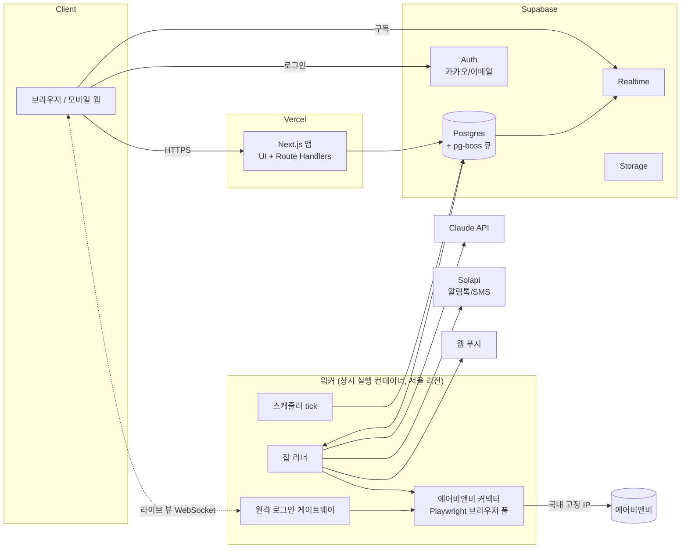
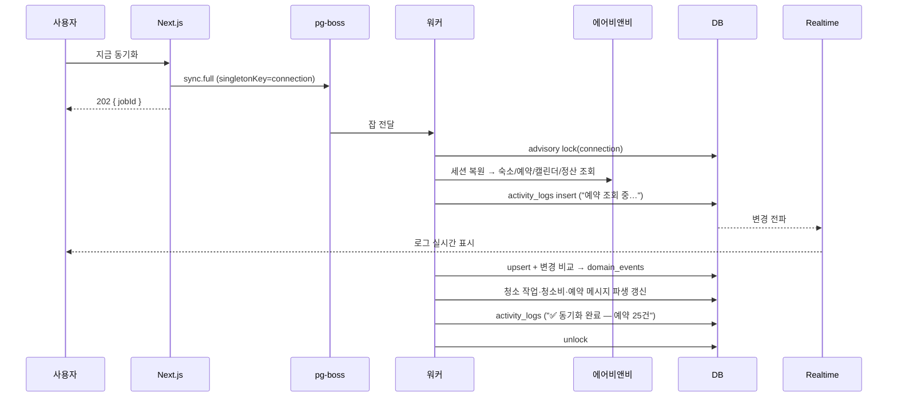

# 03. 시스템 아키텍처

## 1. 전체 구성



| 구성 요소 | 책임 | 하지 않는 것 |
|-----------|------|--------------|
| **Next.js 앱** | UI, 사용자 요청 API, 입력 검증, 잡 등록(지금 동기화·미리보기·발송), 짧은 DB 조회 | 장시간 작업, 브라우저 자동화, 외부 부작용 직접 실행 |
| **워커** | 스케줄 판단, 잡 실행, 커넥터 호출, LLM 호출, 메시지 발송, 도메인 이벤트 처리 | 사용자 HTTP 요청 처리 |
| **Supabase Postgres** | 단일 진실 원천(설정 + 동기화 스냅샷 + 이력), 잡 큐(pg-boss) | — |
| **Supabase Realtime** | 활동 로그·동기화 진행 상황을 브라우저로 푸시 | — |
| **원격 로그인 게이트웨이** | 워커 브라우저 화면을 사용자에게 스트리밍하고 입력을 전달(에어비앤비 로그인 전용) | 그 외 화면 공유 |

Vercel 서버리스 함수는 수행 시간이 제한되고 Chromium을 상시 띄울 수 없습니다. 그래서 브라우저 자동화와 스케줄러는 별도 상시 실행 워커로 분리합니다.

## 2. 기술 스택 (제안)

| 영역 | 선택 | 이유 |
|------|------|------|
| 언어 | TypeScript (웹·워커·공용 패키지 모두) | 도메인 로직을 웹과 워커가 공유 |
| 웹 | Next.js App Router | 기존 프로젝트(lighz)와 같은 스택 |
| UI | Tailwind CSS + shadcn/ui, TanStack Query | 스크린샷의 카드형 UI 톤을 구현하기 쉬움 |
| 검증 | zod (API 입력, 커넥터 응답 파싱, LLM 출력) | 경계마다 같은 도구 |
| DB | Supabase Postgres | 기존 사용 경험, RLS, Realtime |
| 인증 | Supabase Auth (카카오 OAuth + 이메일) | 국내 사용자 가입 마찰 최소화 |
| 잡 큐·스케줄 | **pg-boss** | Postgres만으로 큐·재시도·싱글톤 키·크론 처리, Redis 불필요 |
| 브라우저 자동화 | Playwright (Chromium) | 영속 컨텍스트, 응답 가로채기, CDP 스크린캐스트 |
| 워커 호스팅 | Fly.io 또는 AWS ECS (서울 리전) | 상시 실행, **국내 고정 egress IP** |
| LLM | Claude API (`@anthropic-ai/sdk`) | CS 분류·답변 초안 ([06](06-cs-messaging.md)) |
| 알림톡·SMS | Solapi (대안: NHN Cloud 등 다른 딜러사) | 알림톡 실패 시 SMS 대체 발송 지원 |
| 웹 푸시 | Web Push (VAPID) | 호스트 승인 요청 알림 |
| 관측 | Sentry, pino 구조화 로그, 업타임 체크 | — |
| 비밀 | 환경 변수 + 앱 레벨 AES-256-GCM 암호화(데이터 키는 KMS 또는 Supabase Vault로 관리) | 세션·도어락 비번 보호 |

## 3. 저장소 구조

npm 워크스페이스 모노레포로 구성합니다(별도 패키지 매니저 설치 없이 Node 기본 도구로 동작).

```
apps/
  web/                      Next.js (UI + /api)
  worker/                   잡 러너, 스케줄러, 원격 로그인 게이트웨이
packages/
  core/                     순수 도메인 로직 — 요금 계산, 청소 일정 산출, 템플릿 렌더, KPI 집계
  connectors/core/          채널 중립 인터페이스, DTO, capabilities 타입
  connectors/airbnb/        에어비앤비 커넥터 (이 패키지 밖에서는 에어비앤비를 모름)
  connectors/ical/          iCal 가져오기/내보내기 (M6)
  db/                       마이그레이션(SQL), 생성 타입(supabase gen types), 쿼리 헬퍼
  messaging/                알림톡/SMS/웹푸시 어댑터
  llm/                      Claude 호출, 프롬프트, 출력 스키마
docs/
```

- `packages/core`는 I/O가 없는 순수 함수만 둡니다. 시계는 주입받습니다. 테스트는 이 패키지에 집중합니다(요금 레이어 해석, 당일 인하 상태 머신, 청소 일정 규칙).
- `connectors/airbnb`는 [04](04-airbnb-integration.md)의 인터페이스를 구현합니다. 에어비앤비 웹 변경의 영향은 이 패키지 안에서 끝나야 합니다.
- 다른 채널은 `connectors/<channel>` 패키지를 추가하는 방식으로 붙입니다. 도메인 로직은 채널 이름이 아니라 커넥터의 capabilities로 분기합니다([10 §8](10-multi-channel.md#8-커넥터-capabilities)).

## 4. 설계 원칙

1. **희망 상태 조정(reconcile)**: 요금은 "규칙 → 날짜별 희망 요금 → 현재 요금과 비교 → 차이만 적용" 순으로 처리합니다. 같은 입력이면 몇 번을 실행해도 결과가 같습니다.
2. **외부 부작용은 아웃박스로 처리**: 요금 변경·메시지 발송은 항상 `요청 레코드 생성(pending) → 실행 → 결과 기록` 순서입니다. 각 레코드에는 `idempotency_key`가 있어 재시도해도 중복 실행되지 않습니다.
3. **계정 단위 직렬화**: 에어비앤비 연결 하나에는 동시에 브라우저 작업 하나만 돌립니다(Postgres advisory lock, 키 = connection_id). 사람이 쓰는 패턴과 비슷하게 유지하고 세션 충돌을 막기 위해서입니다.
4. **킬 스위치 우선**: 모든 부작용 잡은 실행 **직전에** `workspace.automation_paused`와 `listing.automation_paused`를 다시 확인합니다.
5. **시간 처리**: 스케줄과 날짜 계산은 숙소 시간대(기본 `Asia/Seoul`), 저장 시각은 `timestamptz`(UTC)로 합니다. 숙박일과 요금일은 `date`입니다.
6. **금액**: 정수(원)와 `currency` 컬럼(기본 `KRW`)으로 저장합니다. 부동소수점은 쓰지 않습니다.
7. **원본 보존**: 커넥터가 받은 원본 응답은 `raw jsonb`로 보관합니다. 파서가 바뀌면 재처리할 수 있습니다.

## 5. 잡과 스케줄링

### 5.1 스케줄러 tick

사용자마다 실행 시각이 다릅니다(10:00 매일, 17:00~23:50 10분마다 등). 그래서 잡별 크론 대신 **1분 tick** 방식을 씁니다.

```
매 1분:
  SELECT * FROM automation_schedules WHERE enabled AND next_run_at <= now() FOR UPDATE SKIP LOCKED
  각 행마다:
    pg-boss.send(kind, payload, { singletonKey: `${kind}:${entity_id}:${slot}` })   -- slot = 예정 시각, 중복 등록 방지
    next_run_at = 다음 실행 시각 계산 (숙소 시간대 기준)
```

설정 화면에서 저장하면 해당 `automation_schedules` 행의 `next_run_at`을 즉시 다시 계산합니다.

### 5.2 잡 목록

| 큐 | 트리거 | 기본 주기 | 직렬화 키 | 재시도 |
|----|--------|-----------|-----------|--------|
| `sync.full` | 스케줄, `지금 동기화` | 30분 | connection | 3회, 지수 백오프 |
| `sync.calendar.far` | 스케줄 | 하루 1회 (91~365일) | connection | 3회 |
| `sync.messages` | 스케줄, 이메일 알림 수신 시 | 3분(CS 자동화 사용 시) / 30분 | connection | 2회 |
| `sync.health` | 스케줄 | 6시간 | connection | 0회 (실패 = 상태 갱신) |
| `pricing.reconcile` | 규칙 변경, 매일 00:10, 예약 변경 이벤트 | — | unit | 3회 |
| `pricing.market` | 사용자 설정 시각 | 매일 | unit | 2회 |
| `pricing.lastminute.tick` | 사용자 설정 구간 | N분마다 | unit | 다음 tick에서 재시도 |
| `availability.push` (M6) | 예약·차단 이벤트 즉시, **우선순위 큐** | — | channel_listing | 5회, 실패 시 즉시 긴급 알림 |
| `sync.ical` (M6) | 스케줄 | 15분 | channel_listing | 3회 |
| `cs.inbound` | 새 게스트 메시지 이벤트 (60초 디바운스) | — | thread | 2회 |
| `cs.scheduled.send` | 발송 예정 시각 도래 | — | connection | 3회 |
| `cleaning.digest` | 직원별 설정 시각 | 매일 | staff | 3회 |
| `cleaning.change` | 예약 변경 이벤트 (10분 디바운스) | — | staff | 3회 |
| `notify.send` | 각 잡에서 생성 | — | — | 3회 후 대체 채널 |
| `maintenance` | 스케줄 | 매일 04:00 | — | — |

### 5.3 도메인 이벤트

동기화 결과의 변화는 `domain_events` 테이블(아웃박스)에 기록하고, 워커가 소비해서 후속 잡을 만듭니다.

| 이벤트 | 발생 조건 | 후속 처리 |
|--------|-----------|-----------|
| `reservation.created` | 새 예약 감지 | `unit_days` 갱신, 예약 메시지 예약 생성, 청소 작업 생성, 청소 변경 알림, 당일 인하 중지(오늘 날짜면), 요금 reconcile, (M6) 다른 채널 차단·이중 예약 검사 |
| `reservation.changed` | 일정·인원 변경 | 예약 메시지 재스케줄, 청소 작업 갱신, 청소 변경 알림, (M6) 다른 채널 차단 범위 조정 |
| `reservation.cancelled` | 취소 감지 | 예약 메시지 취소, 청소 작업·청소비 취소, 청소 변경 알림, 요금 reconcile(공실 복귀), (M6) 우리가 막은 날짜 해제 |
| `thread.message_received` | 새 게스트 메시지 | `cs.inbound` |
| `connection.session_expired` | 세션 만료·보안 확인 | 쓰기 자동화 보류, 호스트 알림 |

## 6. 동기화 흐름



## 7. API 규약

- 경로는 `apps/web/app/api/**/route.ts` (Route Handlers)이고 JSON만 다룹니다.
- **오류 형식**은 기존 프로젝트와 같습니다: `{ "error": { "code": "NOT_FOUND", "message": "숙소를 찾을 수 없습니다." } }`
- 네이밍: DB는 snake_case, API 응답은 camelCase
- 인증: Supabase 세션 쿠키. 모든 요청은 워크스페이스 멤버십을 확인하고, RLS로 한 번 더 막습니다.
- 장시간 작업은 `202 Accepted` + `{ jobId }`를 돌려주고 진행 상황은 Realtime으로 알립니다.
- 입력 검증은 zod로 하고, 실패 시 `400 VALIDATION_ERROR` + 필드별 메시지를 돌려줍니다.

### 주요 엔드포인트

| 메서드 · 경로 | 설명 |
|---------------|------|
| `GET /api/dashboard?month=2026-10&basis=payout\|stay&unitId=` | KPI 카드 값 |
| `POST /api/sync` | 지금 동기화 → `{ jobId }` |
| `GET /api/connections` · `POST /api/connections/airbnb/login` | 연결 목록 · 원격 로그인 세션 시작(1회용 토큰 반환) |
| `GET /api/units` · `PATCH /api/units/:id` | 숙소 목록 · 설정 수정 |
| `GET /api/units/:id/channel-listings` · `PATCH /api/channel-listings/:id` | 숙소의 채널 숙소 목록 · 가격 조정(%)·매핑 변경 (M6) |
| `GET /api/calendar?unitId=&month=` | 날짜별 요금/가용/출처 + 예약 막대 |
| `PUT /api/units/:id/prices` | 날짜 요금 수동 설정 `{ dates, price, lock }` |
| `GET /api/reservations` · `GET /api/reservations/:id` | 예약 목록 · 상세 |
| `GET/POST/PATCH/DELETE /api/expenses` · `/api/recurring-expenses` | 지출 |
| `GET/POST/PATCH/DELETE /api/price-rules` | 기간별 규칙 |
| `GET/PUT /api/units/:id/market-pricing` · `/lastminute-pricing` | 공실 시장가 · 당일 인하 설정 |
| `POST /api/pricing/preview` | 미리보기(규칙 초안 포함 가능) → 날짜별 diff |
| `POST /api/pricing/apply` | 미리보기 결과 적용 → `{ jobId }` |
| `GET /api/price-changes` · `POST /api/price-changes/revert` | 변경 이력 · 되돌리기 |
| `GET /api/threads` · `GET /api/threads/:id` · `POST /api/threads/:id/messages` | 인박스 · 수동 발송 |
| `POST /api/drafts/:id/approve` · `/reject` | AI 초안 승인(수정본 포함 가능) · 폐기 |
| `GET/POST/PATCH/DELETE /api/message-templates` · `/api/knowledge` | 예약 메시지 템플릿 · 지식베이스 |
| `GET/PUT /api/cs-settings` | 응답 모드 설정 |
| `GET/POST/PATCH/DELETE /api/staff` | 청소 직원 |
| `GET /api/cleaning-tasks` · `PATCH /api/cleaning-tasks/:id` | 청소 일정 · 담당자/비용 수정 |
| `POST /api/cleaning/compose` · `POST /api/cleaning/send` | 일정 메시지 자동작성 · 발송 |
| `PATCH /api/workspace/automation` | 킬 스위치, 시뮬레이션 모드 |

## 8. 보안

| 대상 | 대책 |
|------|------|
| 에어비앤비 세션 (쿠키·스토리지) | AES-256-GCM으로 앱 레벨 암호화합니다(봉투 암호화, 데이터 키는 KMS). 복호화는 워커만 할 수 있습니다. 클라이언트 역할에는 해당 컬럼 SELECT 권한을 주지 않습니다. |
| 에어비앤비 비밀번호 | **저장하지 않습니다.** 원격 로그인 창에서 사용자가 에어비앤비 페이지에 직접 입력합니다. 이 입력이 우리 워커를 경유한다는 점은 처리방침에 명시합니다. |
| 원격 로그인 창 | 1회용 토큰, 10분 유효, 연결 1개 전용 브라우저 컨텍스트, 에어비앤비 도메인 외 이동 차단 |
| 도어락 비번 등 비밀 지식 | 암호화해서 저장합니다. LLM에는 보내지 않고 플레이스홀더로 치환합니다([06 §5](06-cs-messaging.md#5-안전장치)). |
| 테넌트 격리 | 모든 테이블에 `workspace_id`를 두고 RLS를 적용합니다([08 §11](08-data-model.md#11-rls와-비밀-데이터)). 워커만 service role을 씁니다. |
| 직원 일정 페이지 | 추측할 수 없는 토큰(해시로 저장), 폐기·재발급 가능, 읽기 전용 + 완료 체크만 허용 |
| 감사 로그 | 설정 변경, 수동 요금 변경, 승인/발송, 연결·해제를 `audit_logs`에 기록합니다. |

### 개인정보

- 처리하는 개인정보: 호스트 계정 정보, **게스트 이름·메시지·인원**, 청소 직원 이름·전화번호
- **국외 이전 고지**: 게스트 메시지를 Claude API(Anthropic, 미국)로 보냅니다. 개인정보처리방침에 국외 이전 항목(이전받는 자, 국가, 목적, 항목, 보유기간)을 적습니다.
- **처리 위탁 고지**: Solapi(알림톡/SMS), Supabase, 호스팅 업체
- **최소 전송**: LLM에는 전화번호와 이메일을 지우고 보냅니다.
- **보존 기간**(제안): 체크아웃 후 24개월이 지나면 게스트 이름을 가명화하고 메시지 본문을 삭제합니다. 정산 금액 통계는 유지합니다.

## 9. 환경과 배포

| 환경 | 구성 |
|------|------|
| local | Supabase CLI(로컬 Postgres/Auth), `apps/worker`를 로컬 실행, 커넥터는 녹화된 응답(fixture) 모드 지원 |
| staging | 별도 Supabase 프로젝트, 워커 1대, **테스트용 에어비앤비 계정**으로 카나리 실행 |
| prod | Supabase(서울 리전), Vercel, 워커 N대(브라우저 풀 크기에 맞춰 수평 확장) |

- 마이그레이션은 `packages/db/migrations/*.sql`에 두고 Supabase CLI로 적용합니다.
- 워커 배포는 블루/그린으로 합니다. 진행 중 잡은 pg-boss가 재전달하고, 부작용 잡은 멱등 키로 중복을 막습니다.
- 브라우저 풀 용량은 동시 활성 컨텍스트 수 × 메모리(컨텍스트당 약 200~400MB, M0에서 측정)로 산정합니다.
