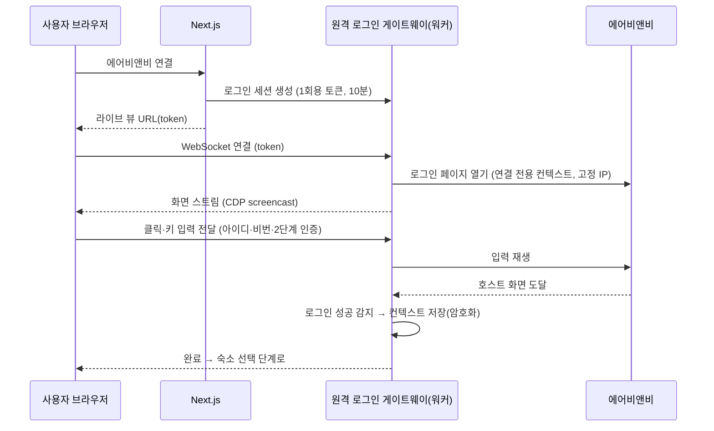
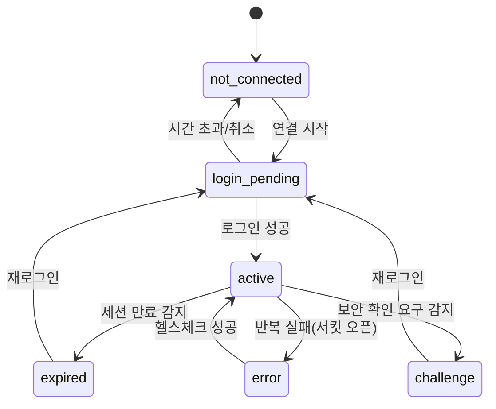

# 04. 에어비앤비 연동

이 플랫폼의 기능은 거의 전부 에어비앤비 데이터 읽기·쓰기에 의존합니다. 그래서 이 문서의 결정이 가장 큰 기술·사업 리스크입니다. **M0 스파이크에서 가장 먼저 검증합니다** ([09](09-roadmap.md)).

## 1. 필요한 연산

| 기능 | 연산 | 종류 | 빈도 |
|------|------|------|------|
| 연결 | 숙소 목록, 숙소 설정(체크인/아웃 시각, 스마트 요금 여부, 당일 예약 마감, 기본 요금) | 읽기 | 연결 시, 하루 1회 |
| 예약 동기화 | 예약 목록·상세(게스트명, 인원, 일정, 상태, 정산 예정액) | 읽기 | 30분 |
| 정산 | 거래·정산 내역(정산일, 금액, 조정금) | 읽기 | 30분 (전체 동기화에 포함) |
| 캘린더 | 날짜별 요금·가용 상태 | 읽기 | 90일 이내 30분, 그 이후 하루 1회 |
| 요금 변경 | 날짜(범위)별 요금 설정 | **쓰기** | 규칙 변경 시, 매일, 당일 인하 시 10분 간격 |
| 시장가 | '비슷한 숙소' 가격 정보 | 읽기 | 하루 1회 |
| 메시지 | 스레드 목록·메시지 | 읽기 | 3분(CS 자동화 사용 시) |
| 메시지 발송 | 스레드에 답장 | **쓰기** | 이벤트 시 |
| 가용성 차단/해제 (M6) | 다른 채널 예약 날짜 차단, 취소 시 해제 | **쓰기** | 다른 채널 예약 이벤트 시 ([10 §3](10-multi-channel.md#3-가용성-동기화-이중-예약-방지)) |

## 2. 선택지

에어비앤비는 일반 호스트용 공개 API를 제공하지 않습니다. 공식 API는 승인된 소프트웨어 파트너(PMS·채널 매니저)에게만 열려 있습니다.

| 방식 | 장점 | 단점 | 판정 |
|------|------|------|------|
| A. 공식 API 파트너 | 안정적이고 약관을 준수 | 신규 승인이 어렵고 요건이 높음, 일정 예측 불가 | 장기 목표로 별도 추진 |
| B. iCal 내보내기 | 공식 기능, 구현 간단 | 예약/차단 날짜만 제공(게스트명·금액·요금·메시지 없음), 읽기 전용, 반영 지연 | 보조 수단(가용 상태 교차 검증) |
| **C. 서버 브라우저 자동화** (호스트 세션 보관) | PC를 꺼도 동작(웹앱의 핵심 가치) | 약관 리스크, 봇 탐지·추가 인증, 세션 보관 보안 부담, 인프라 비용 | **MVP 채택 (확정)** |
| D. 로컬 에이전트·브라우저 확장 | 호스트 본인 IP와 브라우저를 쓰므로 탐지 위험이 낮음 | PC·브라우저가 켜져 있어야 함(기존 한계 그대로), 설치 필요 | 대체 드라이버로 열어둠 |
| E. 공식 파트너 채널 매니저 경유 | 공식 경로 | 호스트가 별도 구독해야 함, 기능 제약, 외부 의존 | 사업 검토 대상 |

### 결정 (확정)

**C를 MVP 드라이버로 채택하고, 커넥터 인터페이스로 추상화해서 D·A·E로 바꿀 수 있게 합니다.**
약관 리스크는 감수하기로 결정했습니다. 완화 조치와 계정 제한 대응 절차는 §10에 있습니다. M0는 진행 여부가 아니라 **기술적 실현성**(세션 유지, 보안 확인 빈도)을 검증합니다.
다른 채널 지원도 계획돼 있으므로([10](10-multi-channel.md)), 인터페이스는 채널 중립으로 만들고 채널마다 지원하는 연산을 `capabilities`로 선언합니다.
C를 고른 이유는 한 가지입니다. "PC를 켜두지 않아도 자동화가 돈다"는 것이 웹앱 전환의 핵심 가치인데, 이를 만족하는 현실적인 선택지가 C뿐입니다.

## 3. 커넥터 인터페이스

```ts
// packages/connectors/airbnb 가 구현. 나머지 코드는 이 인터페이스와 DTO만 안다.
export interface ChannelConnector {
  readonly channel: string;                        // 'airbnb' | 'ical' | ...
  readonly capabilities: ConnectorCapabilities;    // 10 §8. 지원하지 않는 연산은 호출하지 않음

  // 세션
  checkSession(): Promise<SessionStatus>; // 'active' | 'expired' | 'challenge'

  // 읽기
  listListings(): Promise<ListingDTO[]>;
  getListingSettings(listingId: string): Promise<ListingSettingsDTO>;
  listReservations(q: { listingIds: string[]; from: string; to: string }): Promise<ReservationDTO[]>;
  listPayoutLines(q: { from: string; to: string }): Promise<PayoutLineDTO[]>;
  getCalendar(listingId: string, from: string, to: string): Promise<CalendarDayDTO[]>;
  getMarketPrices(listingId: string, dates: string[]): Promise<MarketPriceDTO[]>;
  listThreads(q: { updatedSince?: string }): Promise<ThreadDTO[]>;
  getThreadMessages(threadId: string, q?: { since?: string }): Promise<MessageDTO[]>;

  // 쓰기 — 반드시 결과를 다시 읽어서 확인한 값을 반환
  setPrices(listingId: string, ranges: { from: string; to: string; price: number }[]): Promise<PriceWriteResult[]>;
  setAvailability(listingId: string, ranges: { from: string; to: string; available: boolean }[]): Promise<AvailabilityWriteResult[]>; // M6
  sendMessage(threadId: string, body: string, idempotencyKey: string): Promise<SentMessageDTO>;
}
```

여기서 `listingId`는 채널 쪽 리스팅 식별자(`channel_listings.external_id`)입니다. 숙소(unit)와의 매핑은 커넥터 밖에서 처리합니다.

- DTO는 채널 중립입니다(`externalId`, `checkIn`, `hostPayout` 등). 모든 DTO에는 `raw`(원본 응답 조각)가 들어갑니다.
- 모든 응답은 zod 스키마로 파싱합니다. 파싱 실패는 '응답 형식 변경'으로 분류합니다(§8).
- 쓰기 연산은 **read-after-write**로 확인합니다. 요청한 값과 다시 읽은 값이 다르면 실패로 처리합니다.

## 4. 드라이버 C 구현 전략

### 4.1 실행 단위

- 연결 1개에는 **Playwright 영속 컨텍스트** 1개를 씁니다(쿠키, localStorage, IndexedDB).
- 컨텍스트 상태는 작업이 끝날 때마다 직렬화하고 암호화해서 저장합니다. 다음 작업은 이를 복원해서 시작합니다. 워커 인스턴스가 바뀌어도 세션을 이어갈 수 있습니다.
- 브라우저 풀: 워커 1대가 N개 컨텍스트를 동시에 운용합니다. 연결 1개 안에서는 직렬로 실행합니다(advisory lock).
- 사용자 에이전트, 화면 크기, 언어(`ko-KR`), 시간대(`Asia/Seoul`)는 연결별로 고정합니다. 매번 바꾸면 새 기기로 보여 추가 인증이 뜰 가능성이 커집니다.

### 4.2 데이터 취득 순서

1. **내부 JSON 요청 재사용 (우선)**: 로그인된 페이지 컨텍스트 안에서 에어비앤비 호스트 웹이 실제로 쓰는 요청을 호출하거나 응답을 가로챕니다. DOM보다 안정적이고 빠릅니다.
2. **DOM 파싱 (대체)**: 1이 불가능한 화면만 DOM에서 읽습니다.

내부 요청은 문서화되지 않았기 때문에 언제든 바뀔 수 있습니다. 요청 형식과 파서는 연산마다 파일 하나로 격리하고, 녹화 fixture로 단위 테스트합니다.

기존 도구의 소스코드는 없습니다. 그래서 M0에서 연산마다 호스트 웹이 실제로 보내는 요청과 응답을 처음부터 분석합니다. 분석 결과는 `packages/connectors/airbnb/NOTES.md`에 연산별로 기록하고(화면 경로, 요청 형식, 응답 핵심 필드, DOM 대체 경로), 응답은 fixture로 녹화합니다.

### 4.3 네트워크

- 연결마다 **국내 고정 egress IP**를 할당합니다. 원격 로그인과 이후 작업이 모두 같은 워커 경로를 쓰므로 로그인 IP와 작업 IP가 일치합니다.
- 연결 수가 늘면 IP 풀을 확장합니다. IP 하나에 너무 많은 계정을 몰지 않습니다(상한은 M0에서 결정).

### 4.4 요청 예절

- 연산 사이에 무작위 지연(지터)을 둡니다.
- 연결 1개 안의 작업은 직렬로 처리합니다.
- 필요한 화면만 엽니다. 전체 동기화도 바뀐 부분만 상세 조회합니다.
- 주기는 §1의 표가 상한입니다. 메시지 감지는 §7.3의 이메일 트리거로 폴링을 줄입니다.

## 5. 동기화 상세

### 5.1 범위

| 데이터 | 초기 | 증분 |
|--------|------|------|
| 예약 | 과거 12개월 ~ 향후 12개월 | 향후 예약 전체 + 최근 30일 내 체크아웃 (건수가 작아 전체 재조회가 단순) |
| 캘린더 | 향후 365일 | 0~90일: 30분, 91~365일: 하루 1회 |
| 정산 | 과거 12개월 | 최근 60일 |
| 메시지 | 최근 90일 스레드 | `updatedSince` 기준 |

### 5.2 업서트와 변경 감지

- 키: 예약 `(channel_listing_id, external_code)`, 캘린더 `(channel_listing_id, date)`, 스레드 `(connection_id, external_id)`
- 채널 캘린더를 업서트한 뒤 숙소 단위 가용 상태(`unit_days`)를 다시 계산합니다([08 §4](08-data-model.md#4-숙소채널-숙소예약캘린더정산)).
- 예약은 이전 스냅샷과 비교해 `reservation.created/changed/cancelled` 이벤트를 만듭니다([03 §5.3](03-architecture.md#53-도메인-이벤트)).
- **취소 감지**는 두 경로 모두 처리합니다. (1) 상태가 cancelled로 바뀐 경우, (2) 조회 범위 안에 있어야 할 예약이 목록에서 사라진 경우. (2)는 상세를 재조회해서 확인한 뒤에만 취소로 처리합니다.

## 6. 로그인과 세션 수명주기

### 6.1 원격 로그인 흐름



- 구현 선택지: 직접 구현(Xvfb 없이 headless + CDP `Page.startScreencast` + `Input.dispatch*Event`) 또는 관리형 원격 브라우저 서비스의 라이브 뷰 기능. M0에서 비교합니다.
- 라이브 뷰 안에서는 에어비앤비 도메인 밖으로 이동하지 못하게 막습니다.
- 모바일 화면에서도 입력할 수 있어야 합니다(가상 키보드 입력 전달).

### 6.2 상태 머신



- `sync.health`가 6시간마다 가벼운 요청으로 세션을 확인합니다.
- `expired`/`challenge`가 되면 다음을 처리합니다.
  1. 쓰기 자동화(요금·메시지)를 보류합니다. 보류된 작업은 `held` 상태로 남습니다.
  2. 호스트에게 알림을 보냅니다(웹 푸시 + 알림톡): "에어비앤비 다시 로그인이 필요합니다 [로그인]".
  3. 대시보드 연동 상태를 '재로그인 필요'로 표시합니다.
- **보안 확인(캡차, 본인 확인)은 자동으로 풀려고 하지 않습니다.** 감지하면 즉시 멈추고 사용자에게 넘깁니다.

## 7. 연산별 메모

### 7.1 요금 쓰기

- 입력은 연속 날짜·동일 가격 범위로 묶은 목록입니다(호출 수 최소화).
- 예약됐거나 차단된 날짜, 지난 날짜는 커넥터 호출 전에 걸러냅니다([05](05-pricing-engine.md)).
- 에어비앤비가 거부하는 값(허용 범위 밖 등)은 `failed` + 사유로 기록합니다. 자동 재시도하지 않습니다.

### 7.2 시장가

- 출처는 에어비앤비 호스트 캘린더의 '비슷한 숙소' 가격 정보입니다(기존 도구와 동일).
- 날짜별 `{ min, max, median? }`을 반환합니다. 해당 날짜 정보가 없으면 항목을 생략하고, 요금 엔진은 그 날짜를 건너뜁니다.

### 7.3 새 메시지 감지

- 기본은 `sync.messages` 폴링입니다(CS 자동화 사용 시 3분).
- **이메일 트리거 (선택, 권장)**: 호스트가 에어비앤비 메시지 알림 메일을 전용 수신 주소(`{workspace}@in.<도메인>`)로 전달하도록 설정합니다. 메일이 오면 해당 스레드만 즉시 조회합니다. 이렇게 하면 응답 지연은 줄고 폴링 주기는 30분으로 늘릴 수 있습니다. 수신 메일은 트리거로만 쓰고, 본문은 반드시 커넥터로 다시 읽어옵니다.

### 7.4 메시지 발송

- `idempotencyKey`(= 초안 ID 또는 예약 메시지 ID)를 기록합니다. 발송 전에 스레드의 최근 메시지를 확인해서 이미 같은 내용이 있으면 성공으로 처리합니다(타임아웃 후 재시도에서 중복 발송 방지).

## 8. 실패 처리

| 상황 | 감지 | 대응 |
|------|------|------|
| 세션 만료 | 로그인 페이지로 리다이렉트, 401/403 | `expired`, 쓰기 보류, 호스트 알림 |
| 보안 확인 | 보안 확인 페이지·요소 감지 | `challenge`, 즉시 중단, 재로그인 요청 |
| 응답 형식 변경 | zod 파싱 실패 | **해당 연산만** 서킷 오픈(다른 기능은 계속), raw 저장, 운영자 알림 |
| 일시 오류·제한 | 429/5xx, 타임아웃 | 지수 백오프. 연속 5회 실패하면 연결 단위 서킷 오픈(30분) |
| 쓰기 불일치 | 다시 읽은 값 ≠ 요청 값 | 1회 재시도 후 `failed`, 활동 로그 경고 |
| 계정 제한·정지 | 제한 안내 화면·응답 감지 | 해당 연결 자동화 즉시 중단, [§10.1](#101-계정-제한-대응-절차) 절차 |

서킷 상태는 연산 × 연결 단위로 저장하고 운영 대시보드에 표시합니다.

## 9. 카나리와 계약 테스트

- 운영자 소유의 **테스트 에어비앤비 계정**(실제 숙소 1개, 판매 차단 상태)으로 staging에서 매일 모든 연산을 실행합니다. 읽기, 요금 쓰기 후 원복, 본인 스레드 메시지 발송이 포함됩니다.
- 실패하면 즉시 운영자에게 알리고, 같은 날 prod 연산별 서킷 상태와 대조합니다.
- 응답 fixture를 주기적으로 갱신해서 파서 단위 테스트가 현재 형식을 반영하게 합니다.

## 10. 약관·법적 리스크

- 에어비앤비 서비스 약관에는 허가 없는 자동화 접근(스크래핑, 봇 등)을 제한하는 조항이 있습니다. **호스트 계정이 제한될 위험**이 있습니다.
- **결정: 이 리스크를 감수하고 진행합니다.** 아래 완화 조치는 그대로 유지합니다.
  1. 이용약관과 연결 화면에서 위험을 명확히 고지하고 동의를 받습니다.
  2. 최소 빈도로 접근하고 필요한 연산만 수행합니다(§4.4).
  3. 출시 전에 **법률 검토**를 받습니다. 목적은 진행 여부 판단이 아니라 이용약관, 위험 고지와 동의 문구, 책임 범위(면책) 작성입니다.
  4. A(공식 파트너)와 E(채널 매니저 경유)를 사업적으로 병행 검토합니다. 전환 비용을 낮추려고 커넥터를 추상화했습니다.

### 10.1 계정 제한 대응 절차

리스크를 감수하는 대신, 실제로 제한이 생겼을 때 빨리 알아채고 피해를 줄이는 절차를 둡니다.

| 단계 | 조건 | 조치 |
|------|------|------|
| 감지 | 커넥터가 계정 제한·정지 화면을 감지하거나, 호스트가 신고 | 해당 연결 `status = error`(사유: `account_restricted`), 모든 자동화 즉시 중단, 호스트에게 안내 |
| 기록 | 제한 발생마다 | 연결별 최근 30일 연산 횟수, 주기, IP, 직전 작업을 사고 기록으로 남김 |
| 전체 점검 | 7일 안에 2개 이상 계정에서 제한 발생 | 전 계정의 **쓰기 연산 일시 중단**(읽기는 유지), 공통 원인 분석, 주기·패턴 조정 후 단계적 재개 |
| 재평가 | 제한이 반복되거나 확산됨 | 드라이버 D(로컬 에이전트)로 전환하거나 E 경로를 검토하고, 이 문서를 개정 |

운영 대시보드에 '계정 제한 발생 수(30일)'를 상시 지표로 둡니다.
- 상표: 서비스명·로고·도메인에 'Airbnb/에어비앤비'를 넣지 않습니다. 설명 문구("에어비앤비 호스트를 위한")에서 쓰는 범위는 에어비앤비 브랜드 가이드라인을 확인합니다.

## 11. 대체 드라이버 D (로컬 에이전트) 메모

C가 막히거나, 호스트가 서버 세션 보관을 원하지 않을 때를 위한 대안입니다.

- 데스크톱 에이전트(또는 브라우저 확장)가 같은 `ChannelConnector`를 구현하고, 워커와 WebSocket으로 연결합니다.
- 워커는 해당 연결의 잡을 에이전트로 라우팅합니다. 에이전트가 오프라인이면 잡을 보류하고 대시보드에 표시합니다.
- 기존 도구의 PC 카카오톡 발송 같은 '로컬 전용' 기능도 이 에이전트 위에 다시 얹을 수 있습니다([07 §3](07-cleaning-ops.md#3-발송-채널)).
