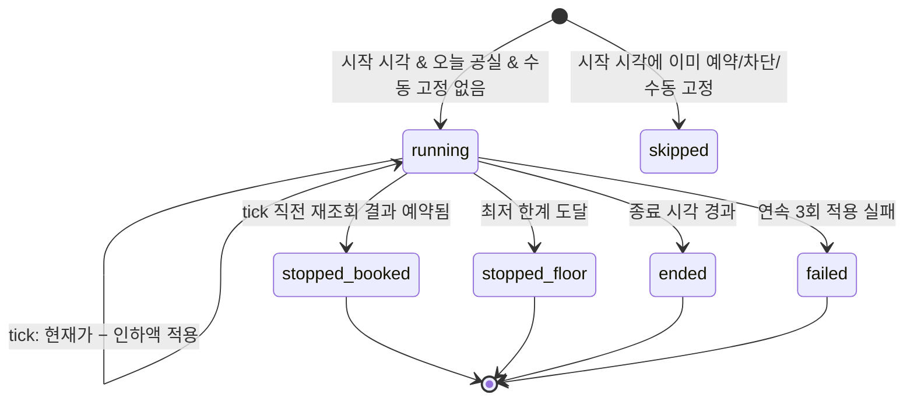

# 05. 요금 엔진

## 1. 범위

| 자동화 | 질문 | 대상 날짜 | 실행 시점 | 출처 |
|--------|------|-----------|-----------|------|
| **기간별 규칙** | "이 기간·요일·남은 일수엔 얼마로?" | 조건에 맞는 공실 | 규칙 변경 시, 매일 00:10, 예약 변경 시 | 신규 (요청 2) |
| 공실 시장가 | "남은 공실을 비슷한 숙소보다 조금 싸게" | 대상 범위(기본: 다음 달)의 공실 | 매일 설정 시각 | 기존 '다음달 공실 자동 가격설정' |
| 당일 인하 | "오늘 밤이 비어 있으면 조금씩 내리자" | 오늘 공실 | 설정 구간 동안 N분마다 | 기존 '자동 요금조정' |
| 수동 | "이 날은 이 값으로 고정" | 지정 날짜 | 즉시 | 캘린더에서 날짜 클릭 |

> '기간별'은 두 가지로 해석할 수 있어 둘 다 지원합니다. **달력 기간**(성수기, 주말, 연휴)과 **남은 기간**(체크인까지 N일 이하 남은 공실)입니다. 둘 다 같은 규칙 모델의 조건으로 표현합니다.

## 2. 계산 모델

요금은 두 단계로 계산합니다. 먼저 **숙소(unit) 단위 희망 요금**을 정하고(§2.1~2.3), 그 값을 **채널 숙소별 요금**으로 바꿉니다(§2.5). MVP는 에어비앤비 채널 하나에 가격 조정 0%이므로 두 값이 같습니다.

### 2.1 레이어 우선순위

날짜 하나의 숙소 희망 요금은 위에서부터 처음 걸리는 레이어로 정합니다.

| 순위 | 레이어 | 비고 |
|------|--------|------|
| 1 | 수동 고정 | 자동화가 손대지 않습니다. 한계(clamp)도 적용하지 않습니다(입력 시 UI가 경고). |
| 2 | 당일 인하 | 오늘 날짜에 당일 인하 실행 기록이 있으면(진행 중·종료 무관) 다른 레이어는 오늘 요금을 건드리지 않습니다. |
| 3 | 고정형 기간 규칙 | 조건이 맞는 고정가 규칙 중 우선순위가 가장 높은 것 |
| 4 | 공실 시장가 | 대상 범위 안이고 신선한 시장 데이터가 있을 때 `시장 최대가 − 할인액` |
| 5 | 숙소 기본가 | 조정형 규칙의 기준값으로만 씁니다. 조정 규칙이 하나도 맞지 않으면 **변경하지 않습니다.** |

**조정형 규칙**(%·금액)은 3~5에서 정한 기준가 위에 덧붙입니다.

- 5(숙소 기본가): 항상 적용
- 3(고정형 규칙): 규칙의 `allow_adjustments`가 켜진 경우에만 (기본 꺼짐. 연휴 고정가에 주말 할증이 또 붙지 않게)
- 4(시장가): 공실 시장가 설정의 `apply_adjustments`가 켜진 경우에만 (기본 꺼짐. 시장가에는 이미 요일·시즌이 반영돼 있어서, 주말 할증을 더하면 '비슷한 숙소보다 싸게'라는 목적이 깨짐)

### 2.2 해석 절차

```ts
// packages/core/pricing/resolve.ts — 순수 함수, I/O 없음
// 숙소 단위 희망 요금을 정한다. 채널별 비교·적용은 toChannelPrices() (§2.5)
function resolveDate(ctx: DateContext): Decision {
  // 0. 대상 여부
  if (ctx.date < ctx.today) return skip('past');
  if (ctx.unitDay.availability !== 'available') return skip('not_vacant');   // 모든 채널 합산 가용 상태
  if (ctx.date > addDays(ctx.today, 365)) return skip('out_of_horizon');
  if (ctx.unit.automationBlocked) return skip(ctx.unit.blockReason);          // 킬스위치·숙소 일시정지

  // 1. 수동 고정
  if (ctx.manualLock) return target(ctx.manualLock.price, [{ layer: 'manual' }]);

  // 2. 당일 인하 소유
  if (ctx.date === ctx.today && ctx.lastminuteRun) return skip('owned_by_lastminute');

  // 3~5. 기준가
  let base: number, allowAdjust: boolean, isDefaultBase = false;
  const fixed = topPriority(ctx.rules.filter(r => r.action.type === 'fixed' && matches(r, ctx)));
  if (fixed) {
    base = fixed.action.price; allowAdjust = fixed.allowAdjustments;
  } else if (ctx.market.inRange) {
    if (!ctx.market.snapshot) return skip('no_market_data');      // 데이터 없으면 건드리지 않음
    base = ctx.market.snapshot.max - ctx.market.discount; allowAdjust = ctx.market.applyAdjustments;
  } else {
    base = ctx.unit.basePrice; allowAdjust = true; isDefaultBase = true;
  }

  // 조정형 규칙: 우선순위 높은 순으로 차례로 적용
  const adjusts = allowAdjust ? byPriorityDesc(ctx.rules.filter(r => r.action.type !== 'fixed' && matches(r, ctx))) : [];
  if (isDefaultBase && adjusts.length === 0) return skip('no_rule');
  let price = base;
  for (const r of adjusts) price = r.action.type === 'percent' ? price * (1 + r.action.value / 100) : price + r.action.value;

  // 한계·반올림 (숙소 단위)
  price = roundTo(clamp(price, ctx.unit.minPrice, ctx.unit.maxPrice), ctx.unit.roundingUnit);
  return target(price, breakdown);
}
```

반환하는 `Decision`에는 `breakdown`(적용된 레이어와 규칙, 단계별 값)이 들어갑니다. 미리보기, 캘린더 툴팁, 변경 이력이 모두 이 값을 그대로 보여줍니다.

### 2.3 계산 예시

숙소 기본가 120,000원, 한계 90,000 ~ 250,000원, 반올림 100원, 오늘 = 2026-10-05 (월), 아래 날짜는 모두 공실로 가정

| 규칙 | 조건 | 동작 | 우선순위 |
|------|------|------|----------|
| 추석 연휴 | 2026-09-23 ~ 09-27 | 고정 220,000 | 90 |
| 여름 성수기 | 매년 07-15 ~ 08-20 | 고정 180,000 | 50 |
| 공휴일 전날 | 공휴일 전날 숙박 | +20% | 40 |
| 주말 | 금·토 숙박 | +15% | 30 |
| 임박 할인 | 체크인까지 0~3일 | −10% | 10 |

| 날짜 | 매칭 | 계산 | 결과 |
|------|------|------|------|
| 10-07 (수) | 임박 할인 | 120,000 × 0.9 | 108,000 |
| 10-08 (목) | 공휴일 전날(10-09 한글날), 임박 할인 | 120,000 × 1.2 × 0.9 | 129,600 |
| 10-10 (토) | 주말 | 120,000 × 1.15 | 138,000 |
| 10-14 (수) | 없음 | — | 변경 없음 (`no_rule`) |
| 11-14 (토), 시장가 대상 | 시장가 (조정 미적용) | 154,000 − 20,000 | 134,000 |

### 2.4 원래 가격 보존과 복원

- 자동화가 채널 숙소의 어떤 날짜를 **처음** 바꿀 때, 직전 값을 `channel_calendar_days.original_price`에 저장합니다.
- 사용자가 규칙을 끄거나 삭제하거나 조건을 바꿔서 이전에 우리가 바꾼 날짜가 더 이상 어떤 규칙에도 맞지 않게 되면, 미리보기에 **"원래 가격으로 복원"** 항목을 보여줍니다(기본 체크).
- 시간이 흘러 생기는 자연스러운 이탈에는 복원하지 않습니다. 예를 들어 '다음 달' 범위가 넘어가서 시장가 대상에서 빠진 날짜는 마지막 값을 그대로 둡니다(기존 도구 동작과 동일).

### 2.5 채널별 요금

```ts
// 숙소 희망 요금 → 채널 숙소별 적용 대상
function toChannelPrices(unitTarget: number, channels: ChannelListingCtx[]): ChannelDecision[] {
  return channels.map(ch => {
    if (!ch.capabilities.prices.includes('write') || !ch.pushPrices) return skip('not_managed');
    if (ch.blockReason) return skip(ch.blockReason);         // 스마트 요금 ON, 연결 비정상(held)
    const price = roundTo(unitTarget * (1 + ch.priceMarkupPct / 100), ch.unit.roundingUnit);
    return price === ch.day.price ? skip('unchanged') : change(price);
  });
}
```

- 가격 조정(%)은 숙소 한계(clamp)를 적용한 **뒤에** 곱합니다. 그래서 채널 요금이 숙소 최고 한계를 넘을 수 있으며, 이는 의도한 동작입니다(수수료 보전).
- 수동 고정 요금에도 채널 가격 조정을 적용합니다. 에어비앤비는 기본 0%이므로 MVP 동작에는 영향이 없습니다.
- 스마트 요금은 에어비앤비 채널 숙소의 속성입니다. 켜져 있으면 그 채널 숙소만 제외합니다.
- 다채널 설계 전반은 [10 §4](10-multi-channel.md#4-채널별-요금)를 참고합니다.

## 3. 기간별 규칙

### 3.1 규칙 모델

```ts
type PriceRule = {
  id: string;
  name: string;
  enabled: boolean;
  priority: number;            // 1~100, 클수록 우선
  unitIds: string[];           // 여러 숙소에 같은 규칙 적용
  conditions: {                // 모두 AND, 비어 있으면 '항상'
    dateRanges?: { from: string; to: string }[];   // 숙박일 기준, 양끝 포함
    repeatYearly?: boolean;                        // true면 연도 무시(MM-DD 비교)
    weekdays?: number[];                           // 0=일 … 6=토 (숙박일의 요일)
    holiday?: 'holiday' | 'holiday_eve';           // 공휴일 당일 숙박 / 공휴일 전날 숙박
    leadDays?: { min?: number; max?: number };     // 체크인까지 남은 일수, 오늘=0
  };
  action:
    | { type: 'fixed'; price: number }
    | { type: 'percent'; value: number }           // -100 < value
    | { type: 'amount'; value: number };
  allowAdjustments?: boolean;  // fixed 전용, 기본 false
};
```

- **공휴일 데이터**: 공공데이터포털 '특일 정보' API(한국천문연구원)를 매월 1회 받아 `holidays` 테이블에 저장합니다. 대체공휴일과 임시공휴일도 포함합니다.
- **남은 일수 조건**은 날마다 결과가 바뀝니다. 그래서 매일 00:10(숙소 시간대)에 향후 365일 reconcile을 돌립니다.
- 조건이 겹치는 **같은 우선순위의 고정형 규칙**은 저장할 때 경고합니다. 엔진의 동률 처리 순서는 (1) 기간이 짧은 규칙(더 구체적), (2) 먼저 만든 규칙입니다.

### 3.2 프리셋

| 프리셋 | 조건 | 기본 동작 |
|--------|------|-----------|
| 주말 할증 | 금·토 | +15% |
| 공휴일 전날 할증 | `holiday_eve` | +20% |
| 성수기 | 매년 07-15 ~ 08-20 | 고정가 입력 |
| 임박 할인 | 남은 일수 0~3 | −10% |
| 원거리 할증 | 남은 일수 60~365 | +5% |

## 4. 공실 시장가 (기존 '다음달 공실 자동 가격설정')

### 4.1 설정

| 필드 | 기본값 | 비고 |
|------|--------|------|
| 자동 설정 | 꺼짐 | |
| 할인액 | 20,000원 | `시장 최대가 − 할인액` |
| 매일 실행 | 10:00 | |
| 대상 범위 (신규) | `next_month` (다음 달 1일~말일) | 또는 `rolling` (오늘+a일 ~ 오늘+b일) |
| 조정 규칙 함께 적용 (신규) | 꺼짐 | §2.1 |
| 이상치 기준 (신규) | ±50% | 전일 스냅샷 대비 |

요금 한계와 반올림 단위는 숙소 설정을 씁니다. 기존 예시(154,319 − 20,000 = **134,319원**)처럼 끝자리까지 그대로 쓰려면 반올림 단위를 1원으로 둡니다. 신규 숙소의 기본값은 1원(기존 동작 유지)이고, 100원이나 1,000원을 권장합니다.

### 4.2 실행

```
매일 run_at:
  dates   = 대상 범위 ∩ 공실
  market  = connector.getMarketPrices(출처 채널 숙소(에어비앤비), dates)   → market_snapshots(unit) 저장
  각 날짜: 전일 스냅샷 대비 변동이 이상치 기준을 넘으면 해당 스냅샷을 'anomaly'로 표시 → 사용하지 않음
  reconcile(unit, dates)
```

- 신선한 데이터는 36시간 이내 스냅샷으로 정의합니다. 대상 날짜인데 신선한 데이터가 없으면 그 날짜는 변경하지 않습니다(`no_market_data`).
- `지금 한 번 적용해보기`는 위 절차를 즉시 실행하되, **미리보기를 보여주고 확인을 받은 뒤** 적용합니다.

## 5. 당일 인하 (기존 '자동 요금조정')

### 5.1 설정

| 필드 | 예시 | 비고 |
|------|------|------|
| 자동 조정 | 켜짐 | |
| 시작 시각 / 종료 시각 | 17:00 / 23:50 | 같은 날 안에서만 (자정을 넘는 구간 미지원) |
| 조정 주기 | 10분 | 최소 5분 |
| 1회 인하액 | 1,000원 | |
| 최저 한계 | 92,000원 | 숙소 최저 한계보다 낮으면 숙소 한계를 적용 |
| 실행 요일 (신규) | 매일 | 예: 일~목만 |

- 시작 시각에 첫 인하를 하고, 이후 주기마다 종료 시각까지 실행합니다. 17:00~23:50, 10분 주기라면 최대 42회입니다.
- 설정을 저장할 때 채널 숙소들의 **당일 예약 마감 시각**과 비교합니다(에어비앤비: `channel_settings.sameDayCutoff`). 종료 시각이 더 늦으면 경고하고 종료 시각 조정을 제안합니다.

### 5.2 상태 머신 (숙소 × 날짜)



### 5.3 tick 처리

```
tick(unit, now):
  킬스위치/설정 꺼짐 → 종료
  today = 숙소 시간대 기준 날짜
  run = lastminute_runs(unit, today) 조회 또는 생성
  run이 종료 상태면 → 반환
  fresh = 숙소의 모든 채널 숙소에서 오늘 가용·요금 재조회      // 매 tick 실시간 (가용 읽기 지원 채널)
  어느 채널이든 공실이 아님 → stopped_booked
  current = 기준 채널 숙소(에어비앤비)의 방금 읽은 요금 ÷ (1 + 가격 조정%)   // 숙소 단위로 환산
  run이 새로 생성됐으면 → start_price = current
  current <= floor → stopped_floor
  next = max(floor, current − step)
  적용 파이프라인(§6)으로 반영 (source = lastminute, 요금 관리 중인 모든 채널)
  next == floor → stopped_floor
```

- 매 tick의 기준값은 **에어비앤비에서 방금 읽은 값**입니다. 호스트가 앱에서 직접 요금을 바꿨다면 그 값에서 이어서 내립니다.
- 다른 채널에서 오늘 예약이 들어와도 tick 직전 재조회에서 걸러집니다([10 §4](10-multi-channel.md#4-채널별-요금)).
- 예시: 시작가 120,000원, 최저 92,000원, 1,000원씩, 10분마다 → 21:30에 92,000원 도달 → `stopped_floor`
- 다음 날로 넘어가도 원복할 필요가 없습니다(지난 날짜). 대시보드 '오늘의 자동화' 카드에 진행 상태를 표시합니다.

## 6. 적용 파이프라인

```
reconcile(unitId, dateRange, { trigger, dryRun })
  1. 로드: 숙소 설정, 규칙, 수동 고정, 시장 스냅샷, 당일 인하 실행, unit_days, 채널 숙소들과 channel_calendar_days
     - 대상 범위 캘린더가 10분보다 오래됐으면 커넥터로 먼저 재조회
  2. 날짜별 resolveDate() → 숙소 희망 요금
  3. 날짜 × 채널 숙소별 toChannelPrices() → ChannelDecision[]
  4. dryRun이면 결과 반환 (= 미리보기 API 응답, 채널별 열로 표시)
  5. 안전장치(§7) 검사 → 위반 항목은 skip + 경고
  6. price_changes INSERT (status = pending,
       idempotency_key = hash(channel_listing, date, price, ruleset_version))
     - 시뮬레이션 모드면 status = simulated 로 기록하고 종료
  7. 채널 숙소마다 연속 날짜·같은 가격을 범위로 묶어 connector.setPrices()
  8. read-after-write 결과로 status = applied | failed
     channel_calendar_days.price / price_source / original_price(최초 1회) 갱신
     activity_logs 요약 1줄 ("DMC역 요금 12건 변경 — 주말 할증")
```

- 직렬화 키는 `unit`입니다. 같은 숙소의 reconcile과 당일 인하 tick은 동시에 돌지 않습니다.
- 되돌리기(`POST /api/price-changes/revert`)는 선택한 변경의 `old_price`를 희망가로 하는 수동 변경입니다(source = `revert`). 수동 고정은 만들지 않습니다.

## 7. 안전장치

| 장치 | 기본값 | 위반 시 |
|------|--------|---------|
| 숙소 최저/최고 한계 | **자동화를 켜려면 필수 입력** | clamp |
| 1회 변경폭 | 현재가 대비 ±40% | 자동 실행: 건너뜀 + 경고 / 미리보기: '확인 필요' 표시 |
| 날짜별 하루 변경 횟수 | 3회 (당일 인하 제외) | 건너뜀 + 경고 |
| 숙소별 하루 변경 날짜 수 | 400 | **잡 중단** + 운영자 알림 (버그 폭주 방지) |
| 스마트 요금 ON | — | 해당 에어비앤비 채널 숙소를 적용 대상에서 제외 |
| 연결 비정상 | — | `held`로 보류, 재연결 후 재계산 |
| 킬 스위치 | — | 커넥터 호출 직전에 확인 |
| 시뮬레이션 모드 | 신규 워크스페이스 첫 24시간 권장 | 계산·기록만 |

## 8. 엣지 케이스

| 상황 | 처리 |
|------|------|
| 예약 취소로 공실 복귀 | `reservation.cancelled` → 해당 범위 reconcile |
| 당일 인하 종료 후 오늘 예약 취소 | 오늘은 당일 인하 소유이므로 변경하지 않음 |
| 수동 고정이 한계 밖 | 허용(호스트 명시 의사), 입력 시 경고 |
| 에어비앤비 기본가 변경 | 하루 1회 숙소 설정 동기화로 반영 → 조정 규칙만 걸린 날짜 재계산 |
| 시장 데이터 일부 날짜 누락 | 해당 날짜만 `no_market_data` |
| 동일 날짜에 여러 숙소 | 숙소별로 독립 계산 |
| 최소 숙박일·고아 날짜 | v1 범위 밖. 후속 후보: 기간별 최소 숙박일, 고아 날짜(예약 사이 1~2박) 할인 |

## 9. 테스트

- `resolveDate()`: 표 기반 단위 테스트. §2.3 예시를 그대로 테스트 케이스로 씁니다.
- 속성 테스트: 수동 고정이 아닌 모든 결과는 `[minPrice, maxPrice]` 안에 있어야 합니다. 예약된 날짜는 절대 `change`가 아니어야 합니다.
- 당일 인하 상태 머신: 가짜 시계로 17:00~23:50을 시뮬레이션하고 예약 발생, 최저가 도달, 적용 실패 시나리오를 검증합니다.
- 파이프라인: 커넥터 목(mock)으로 멱등성(같은 reconcile 2회 → 두 번째는 변경 0건)을 검증합니다.

## 10. 결정 필요

- 시장가 기반 날짜에 조정 규칙을 적용할지의 기본값. 제안은 '적용 안 함'입니다.
- 반올림 단위 기본값. 제안은 신규 숙소 1원(기존 동작)이고, 온보딩에서 1,000원을 권장합니다.
- 1회 변경폭 ±40%, 하루 변경 날짜 400건 상한의 적정성. 베타 데이터로 조정합니다.
