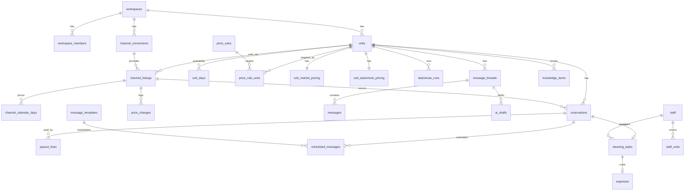

# 08. 데이터 모델

Supabase Postgres(15+) 기준의 첫 마이그레이션 초안입니다. 테이블 간 외래 키 생성 순서는 실제 마이그레이션 파일에서 조정합니다.
다채널 확장([10](10-multi-channel.md))에 대비해 **숙소(`units`)와 채널 숙소(`channel_listings`)를 처음부터 분리**합니다. MVP에서는 둘이 1:1입니다.

## 1. 규칙

- 테이블·컬럼은 snake_case, PK는 `uuid default gen_random_uuid()`입니다. 로그성 테이블만 `bigserial`을 씁니다.
- 테넌트 데이터에는 모두 `workspace_id`를 넣습니다(RLS 기준, 조인 없이 필터).
- 시각은 `timestamptz`, 숙박일과 요금일은 `date`, 금액은 `int`(원)입니다. 음수는 조정금처럼 허용하는 곳에만 씁니다.
- 열거값은 Postgres enum 대신 `text + check`로 둡니다. 값을 추가할 때 마이그레이션이 단순합니다.
- 외부 원본은 `raw jsonb`, 외부 식별자는 `external_id` / `external_code`로 부릅니다.
- **운영 데이터는 `unit_id`에 붙이고**, 채널에서 온 데이터와 채널로 쓰는 데이터에는 `channel_listing_id`를 붙입니다.
- `created_at`, `updated_at`은 아래 DDL에서 생략한 곳도 모든 테이블에 둡니다(`updated_at`은 트리거로 갱신).

## 2. ERD (핵심)



## 3. 계정·연동

```sql
create table workspaces (
  id                uuid primary key default gen_random_uuid(),
  name              text not null,
  timezone          text not null default 'Asia/Seoul',
  automation_paused boolean not null default false,   -- 킬 스위치
  simulation_mode   boolean not null default false,
  plan              text not null default 'beta',
  created_at        timestamptz not null default now()
);

create table workspace_members (
  workspace_id uuid references workspaces on delete cascade,
  user_id      uuid references auth.users on delete cascade,
  role         text not null check (role in ('owner','manager','viewer')),
  primary key (workspace_id, user_id)
);

create table channel_connections (                  -- 채널 계정 1개 (에어비앤비 호스트 계정 등)
  id                  uuid primary key default gen_random_uuid(),
  workspace_id        uuid not null references workspaces on delete cascade,
  channel             text not null,                -- airbnb | (후속 채널)
  external_account_id text,
  display_name        text,
  status              text not null check (status in
                        ('not_connected','login_pending','active','expired','challenge','error')),
  egress_ip           text,
  last_health_at      timestamptz,
  last_sync_at        timestamptz,
  last_error          jsonb,
  -- 같은 채널 계정을 두 워크스페이스가 동시에 자동화하면 요금이 충돌하므로 금지
  unique (channel, external_account_id)
);

-- 비밀 데이터는 별도 테이블. RLS를 켜고 정책을 두지 않음 → service role(워커)만 접근
create table connection_secrets (
  connection_id      uuid primary key references channel_connections on delete cascade,
  session_ciphertext bytea not null,     -- AES-256-GCM, 봉투 암호화
  key_id             text not null,
  updated_at         timestamptz not null default now()
);

create table login_sessions (                       -- 원격 로그인 1회용 세션
  id            uuid primary key default gen_random_uuid(),
  connection_id uuid not null references channel_connections on delete cascade,
  token_hash    text not null unique,
  status        text not null check (status in ('pending','connected','succeeded','expired','cancelled')),
  expires_at    timestamptz not null
);

create table connector_circuits (                   -- 연산별 서킷 브레이커 (04 §8)
  connection_id uuid references channel_connections on delete cascade,
  operation     text not null,                       -- listReservations, setPrices, ...
  state         text not null check (state in ('closed','open','half_open')),
  failures      int not null default 0,
  opened_at     timestamptz,
  last_error    jsonb,
  primary key (connection_id, operation)
);
```

## 4. 숙소·채널 숙소·예약·캘린더·정산

```sql
-- 숙소: 실제 운영 공간. 운영 설정은 모두 여기에
create table units (
  id                   uuid primary key default gen_random_uuid(),
  workspace_id         uuid not null references workspaces on delete cascade,
  nickname             text not null,                 -- 'DMC역'
  timezone             text not null default 'Asia/Seoul',
  checkin_time         time not null default '15:00',
  checkout_time        time not null default '11:00',
  base_price           int,                            -- 조정 규칙 기준가 (연결 시 에어비앤비 기본 요금으로 초기화)
  min_price            int,                            -- 요금 자동화 사용 시 필수
  max_price            int,
  rounding_unit        int not null default 1,
  currency             text not null default 'KRW',
  default_cleaning_fee int not null default 0,
  automation_paused    boolean not null default false,
  active               boolean not null default true,
  check (min_price is null or max_price is null or min_price <= max_price)
);

-- 채널 숙소: 채널에 올린 리스팅. 숙소 1개에 채널별로 여러 개 (MVP는 에어비앤비 1개)
create table channel_listings (
  id                uuid primary key default gen_random_uuid(),
  workspace_id      uuid not null,
  unit_id           uuid not null references units on delete cascade,
  channel           text not null,                     -- airbnb | ical | direct | (후속 채널)
  connection_id     uuid references channel_connections on delete cascade,  -- ical/direct는 null
  external_id       text,
  title             text,
  price_markup_pct  numeric not null default 0,        -- 채널별 가격 조정 (10 §4)
  push_prices       boolean not null default true,
  push_availability boolean not null default true,     -- 다른 채널 예약 시 차단 반영 (10 §3)
  channel_base_price int,                              -- 채널 기본 요금 (동기화)
  channel_settings  jsonb not null default '{}',       -- 채널 전용 값. airbnb: { smartPricingOn, sameDayCutoff }
  raw               jsonb,
  synced_at         timestamptz,
  unique (connection_id, external_id)
);
create unique index on channel_listings (unit_id) where channel = 'direct';

create table reservations (
  id                 uuid primary key default gen_random_uuid(),
  workspace_id       uuid not null,
  unit_id            uuid not null references units on delete cascade,
  channel_listing_id uuid not null references channel_listings on delete cascade,
  channel            text not null,                    -- 비정규화 (필터·배지)
  external_code      text,                             -- 예약 코드. direct는 null
  status             text not null check (status in ('inquiry','pending','confirmed','cancelled')),
  guest_name         text,
  guest_locale       text,
  guest_count        int,
  adults             int, children int, infants int,
  check_in           date not null,
  check_out          date not null,
  nights             int generated always as (check_out - check_in) stored,
  booked_at          timestamptz,
  guest_total        int,                              -- 게스트 결제액 (가능할 때)
  host_payout        int,                              -- 예정 순 정산액
  currency           text not null default 'KRW',
  thread_external_id text,
  cancelled_at       timestamptz,
  raw                jsonb,
  synced_at          timestamptz,
  unique (channel_listing_id, external_code)
);
create index on reservations (unit_id, check_in);
create index on reservations (workspace_id, check_out);

-- 매출(정산일 기준)의 원천. 조정금·취소 수수료·환불·채널 수수료까지 행 단위로 기록
create table payout_lines (
  id                 uuid primary key default gen_random_uuid(),
  workspace_id       uuid not null,
  channel            text not null,
  connection_id      uuid references channel_connections on delete cascade,
  unit_id            uuid references units,
  channel_listing_id uuid references channel_listings,
  reservation_id     uuid references reservations,
  external_id        text,
  payout_date        date not null,
  amount             int not null,                     -- 음수 가능
  kind               text not null check (kind in ('reservation','adjustment','cancellation_fee',
                       'resolution','commission','payment_fee','other')),
  status             text not null check (status in ('scheduled','paid')),
  currency           text not null default 'KRW',
  raw                jsonb,
  unique (connection_id, external_id)
);
create index on payout_lines (workspace_id, payout_date);

-- 숙소 단위 가용 상태: 모든 채널 예약 + 호스트 차단의 합 (요금 엔진·가동률의 기준)
create table unit_days (
  workspace_id   uuid not null,
  unit_id        uuid not null references units on delete cascade,
  date           date not null,
  availability   text not null check (availability in ('available','booked','blocked')),
  reservation_id uuid references reservations,
  block_source   text,                                 -- host_app | host_channel | null
  primary key (unit_id, date)
);

-- 채널 숙소 단위 캘린더: 채널이 보고한 요금·가용 + 우리가 쓴 흔적
create table channel_calendar_days (
  workspace_id          uuid not null,
  channel_listing_id    uuid not null references channel_listings on delete cascade,
  date                  date not null,
  price                 int,
  availability          text not null check (availability in ('available','booked','blocked')),
  blocked_by_us         boolean not null default false,  -- 다른 채널 예약 때문에 우리가 막음 (루프 방지, 10 §3.1)
  min_nights            int,
  price_source          text,          -- manual | period | market | lastminute | revert | external
  price_rule_id         uuid,
  original_price        int,           -- 자동화가 처음 바꾸기 직전 값 (05 §2.4)
  last_changed_by_us_at timestamptz,
  synced_at             timestamptz not null,
  primary key (channel_listing_id, date)
);

create table holidays (                  -- 공공데이터포털 특일 정보
  date date primary key,
  name text not null,
  kind text not null check (kind in ('public','substitute','temporary'))
);
```

## 5. 지출

```sql
create table recurring_expenses (
  id           uuid primary key default gen_random_uuid(),
  workspace_id uuid not null,
  unit_id      uuid references units on delete cascade,
  category     text not null,
  amount       int not null check (amount >= 0),
  day_of_month int not null check (day_of_month between 1 and 28),
  memo         text,
  starts_on    date not null,
  ends_on      date,
  active       boolean not null default true
);

create table expenses (
  id                   uuid primary key default gen_random_uuid(),
  workspace_id         uuid not null,
  unit_id              uuid references units on delete set null,
  date                 date not null,
  category             text not null check (category in
                         ('cleaning','supplies','utilities','rent','maintenance','other')),
  amount               int not null check (amount >= 0),
  memo                 text,
  source               text not null check (source in ('manual','cleaning_task','recurring')),
  cleaning_task_id     uuid unique references cleaning_tasks on delete cascade,
  recurring_expense_id uuid references recurring_expenses on delete set null
);
create index on expenses (workspace_id, date);
```

## 6. 요금

```sql
create table price_rules (                       -- 기간별 규칙 (05 §3.1)
  id                uuid primary key default gen_random_uuid(),
  workspace_id      uuid not null,
  name              text not null,
  enabled           boolean not null default true,
  priority          int not null check (priority between 1 and 100),
  conditions        jsonb not null,               -- { dateRanges, repeatYearly, weekdays, holiday, leadDays }
  action            jsonb not null,               -- { type: fixed|percent|amount, ... }
  allow_adjustments boolean not null default false,
  version           int not null default 1,       -- 수정 시 +1, 멱등 키에 포함
  created_by        uuid
);

create table price_rule_units (
  rule_id uuid references price_rules on delete cascade,
  unit_id uuid references units on delete cascade,
  primary key (rule_id, unit_id)
);

create table unit_market_pricing (               -- 공실 시장가 (05 §4)
  unit_id                  uuid primary key references units on delete cascade,
  workspace_id             uuid not null,
  source_channel_listing_id uuid references channel_listings,   -- 시장 데이터 출처 (에어비앤비)
  enabled                  boolean not null default false,
  discount                 int not null default 20000,
  run_at                   time not null default '10:00',
  range_kind               text not null default 'next_month' check (range_kind in ('next_month','rolling')),
  range_from_days          int,
  range_to_days            int,
  apply_adjustments        boolean not null default false,
  anomaly_ratio            numeric not null default 0.5
);

create table unit_lastminute_pricing (           -- 당일 인하 (05 §5)
  unit_id      uuid primary key references units on delete cascade,
  workspace_id uuid not null,
  enabled      boolean not null default false,
  start_time   time not null default '17:00',     -- 기본값은 기존 도구 안내 예시
  end_time     time not null default '23:00',
  interval_min int  not null default 30 check (interval_min >= 5),
  step_amount  int  not null default 5000 check (step_amount > 0),
  floor_price  int  not null,
  weekdays     int[] not null default '{0,1,2,3,4,5,6}',
  check (start_time < end_time)
);

create table manual_price_locks (                -- 숙소 단위 고정가 (채널 가격 조정은 적용)
  unit_id      uuid references units on delete cascade,
  date         date,
  workspace_id uuid not null,
  price        int not null,
  created_by   uuid,
  primary key (unit_id, date)
);

create table market_snapshots (
  unit_id        uuid references units on delete cascade,
  date           date,
  captured_on    date,
  similar_min    int,
  similar_max    int,
  similar_median int,
  anomaly        boolean not null default false,
  raw            jsonb,
  primary key (unit_id, date, captured_on)
);

create table lastminute_runs (
  unit_id              uuid references units on delete cascade,
  date                 date,
  workspace_id         uuid not null,
  status               text not null check (status in
                         ('running','skipped','stopped_booked','stopped_floor','ended','failed')),
  start_price          int,                       -- 숙소 단위 가격
  current_price        int,
  floor_price          int not null,
  steps                int not null default 0,
  consecutive_failures int not null default 0,
  last_tick_at         timestamptz,
  ended_at             timestamptz,
  primary key (unit_id, date)
);

create table price_changes (                     -- 채널 요금 변경 이력 + 아웃박스
  id                 uuid primary key default gen_random_uuid(),
  workspace_id       uuid not null,
  unit_id            uuid not null references units on delete cascade,
  channel_listing_id uuid not null references channel_listings on delete cascade,
  date               date not null,
  old_price          int,
  new_price          int not null,
  unit_price         int not null,                -- 채널 조정 전 숙소 희망가
  source             text not null check (source in ('manual','period','market','lastminute','revert')),
  rule_id            uuid,
  rule_version       int,
  breakdown          jsonb,                       -- resolveDate() 결과
  trigger            text not null,               -- schedule | rule_saved | reservation_event | user_apply | lastminute_tick
  idempotency_key    text not null unique,
  status             text not null check (status in
                       ('pending','applying','applied','failed','skipped','simulated','held')),
  error              jsonb,
  created_by         uuid,
  applied_at         timestamptz
);
create index on price_changes (channel_listing_id, date, created_at desc);
create index on price_changes (workspace_id, created_at desc);
```

## 7. 멀티채널 (M6, [10](10-multi-channel.md))

테이블은 M6에서 만들지만, 위 테이블들은 이미 이 구조를 전제로 설계했습니다.

```sql
create table availability_changes (              -- 다른 채널 차단/해제 아웃박스 (10 §3)
  id                    uuid primary key default gen_random_uuid(),
  workspace_id          uuid not null,
  channel_listing_id    uuid not null references channel_listings on delete cascade,
  date_from             date not null,
  date_to               date not null,            -- 포함
  action                text not null check (action in ('block','unblock')),
  cause_reservation_id  uuid references reservations,
  idempotency_key       text not null unique,
  status                text not null check (status in ('pending','applying','applied','failed','held')),
  error                 jsonb,
  applied_at            timestamptz
);

create table booking_conflicts (                 -- 이중 예약 감지 (10 §3.3)
  id               uuid primary key default gen_random_uuid(),
  workspace_id     uuid not null,
  unit_id          uuid not null references units on delete cascade,
  reservation_a_id uuid not null references reservations,
  reservation_b_id uuid not null references reservations,
  overlap_from     date not null,
  overlap_to       date not null,
  detected_at      timestamptz not null default now(),
  resolved_at      timestamptz
);

create table ical_feeds (                        -- 채널 숙소별 iCal 내보내기 URL (10 §7)
  channel_listing_id uuid primary key references channel_listings on delete cascade,
  workspace_id       uuid not null,
  token_hash         text not null unique,
  created_at         timestamptz not null default now()
);
-- iCal 가져오기 URL은 channel_listings(channel = 'ical').channel_settings.importUrl
```

## 8. 메시지

```sql
create table message_threads (
  id                 uuid primary key default gen_random_uuid(),
  workspace_id       uuid not null,
  channel            text not null,
  connection_id      uuid not null references channel_connections on delete cascade,
  unit_id            uuid references units,
  channel_listing_id uuid references channel_listings,
  reservation_id     uuid references reservations,
  external_id        text not null,
  guest_name         text,
  guest_locale       text,
  state              text not null check (state in
                       ('open','needs_reply','awaiting_approval','replied','archived')),
  urgent             boolean not null default false,
  last_message_at    timestamptz,
  last_inbound_at    timestamptz,
  last_host_reply_at timestamptz,                 -- '사람이 대화 중' 판단 (06 §5.1)
  last_auto_reply_at timestamptz,
  synced_at          timestamptz,
  unique (connection_id, external_id)
);
create index on message_threads (workspace_id, state, last_message_at desc);

create table messages (
  id                   uuid primary key default gen_random_uuid(),
  workspace_id         uuid not null,
  thread_id            uuid not null references message_threads on delete cascade,
  external_id          text,                      -- 발송 전에는 null
  direction            text not null check (direction in ('inbound','outbound')),
  sender_role          text not null check (sender_role in ('guest','host','cohost','system')),
  origin               text not null check (origin in ('channel','manual','template','ai_auto','ai_approved')),
  body                 text not null,
  body_ko              text,                      -- 번역 캐시
  sent_at              timestamptz,
  scheduled_message_id uuid,
  draft_id             uuid,
  idempotency_key      text unique,
  delivery_status      text check (delivery_status in ('pending','sent','failed')),
  unique (thread_id, external_id)
);
create index on messages (thread_id, sent_at);

create table message_templates (
  id                  uuid primary key default gen_random_uuid(),
  workspace_id        uuid not null,
  name                text not null,
  trigger             text not null check (trigger in ('booking_confirmed','before_checkin','checkin_day',
                        'after_checkin','before_checkout','after_checkout')),
  anchor              text not null check (anchor in ('booking','checkin','checkout')),
  offset_minutes      int,                        -- 방식 1: 기준 시각 ± 분
  day_offset          int,                        -- 방식 2: D ± n일 ...
  send_time           time,                       --         ... 고정 시각
  channels            text[],                     -- 대상 채널, null = 전체 (10 §5)
  respect_quiet_hours boolean not null default true,
  default_locale      text not null default 'ko',
  auto_translate      boolean not null default false,
  enabled             boolean not null default true,
  version             int not null default 1,
  check ((offset_minutes is not null) <> (day_offset is not null and send_time is not null))
);

create table message_template_bodies (
  template_id uuid references message_templates on delete cascade,
  locale      text,
  body        text not null,
  translated  boolean not null default false,     -- 자동 번역본 여부
  primary key (template_id, locale)
);

create table message_template_units (
  template_id uuid references message_templates on delete cascade,
  unit_id     uuid references units on delete cascade,
  primary key (template_id, unit_id)
);

create table scheduled_messages (
  id               uuid primary key default gen_random_uuid(),
  workspace_id     uuid not null,
  reservation_id   uuid not null references reservations on delete cascade,
  template_id      uuid not null references message_templates on delete cascade,
  template_version int not null,
  scheduled_at     timestamptz not null,
  status           text not null check (status in ('pending','sent','skipped','cancelled','failed','held')),
  reason           text,                          -- late_booking, missing_variable, secret_window, channel_unsupported ...
  message_id       uuid references messages,
  unique (reservation_id, template_id)
);
create index on scheduled_messages (scheduled_at) where status = 'pending';

create table knowledge_items (
  id            uuid primary key default gen_random_uuid(),
  workspace_id  uuid not null,
  unit_id       uuid not null references units on delete cascade,
  key           text not null,                    -- checkin_method | wifi | parking | ... | faq
  title         text,
  content       text,                             -- 비밀 항목이면 null (값은 knowledge_secrets)
  is_secret     boolean not null default false,
  visibility    text not null check (visibility in ('public','confirmed','checkin_window')),
  window_hours  int,
  staff_visible boolean not null default false,   -- 직원 일정 페이지 노출 (07 §6)
  sort          int not null default 0
);

create table knowledge_secrets (                  -- RLS 정책 없음 → 서버만 접근
  item_id    uuid primary key references knowledge_items on delete cascade,
  ciphertext bytea not null,
  key_id     text not null
);

create table ai_drafts (
  id                  uuid primary key default gen_random_uuid(),
  workspace_id        uuid not null,
  thread_id           uuid not null references message_threads on delete cascade,
  trigger_message_ids uuid[] not null,
  model               text not null,
  effort              text,
  output              jsonb not null,             -- DraftOutput 원본 (06 §6.2)
  intent              text,
  urgency             text,
  confidence          numeric,
  grounded            boolean,
  policy_decision     text not null check (policy_decision in ('auto_send','needs_approval','escalate')),
  policy_reasons      text[] not null default '{}',
  status              text not null check (status in
                        ('pending','auto_sent','approved','edited_sent','rejected','expired','failed')),
  final_body          text,
  reviewed_by         uuid,
  reviewed_at         timestamptz,
  input_tokens        int,
  output_tokens       int,
  cache_read_tokens   int
);
create index on ai_drafts (workspace_id, status, created_at desc);

create table cs_settings (
  id                  uuid primary key default gen_random_uuid(),
  workspace_id        uuid not null,
  unit_id             uuid references units on delete cascade,   -- null = 워크스페이스 기본값
  reply_mode          text not null default 'draft' check (reply_mode in ('off','draft','auto')),
  auto_intents        text[] not null default '{}',
  min_confidence      numeric not null default 0.8,
  reply_delay_sec     int not null default 90,
  quiet_start         time,
  quiet_end           time,
  secret_window_hours int not null default 24,
  tone_example        text,
  notify_channels     text[] not null default '{web_push}',
  unique nulls not distinct (workspace_id, unit_id)
);
```

## 9. 청소

```sql
create table staff (
  id                 uuid primary key default gen_random_uuid(),
  workspace_id       uuid not null,
  name               text not null,
  phone              text not null,
  kakao_display_name text,
  memo               text,
  active             boolean not null default true,
  share_token_hash   text unique                  -- 직원 일정 페이지 토큰 해시
);

create table staff_units (
  staff_id   uuid references staff on delete cascade,
  unit_id    uuid references units on delete cascade,
  is_primary boolean not null default false,
  primary key (staff_id, unit_id)
);

create table staff_notification_settings (
  staff_id               uuid primary key references staff on delete cascade,
  digest_enabled         boolean not null default false,
  digest_time            time not null default '20:00',
  digest_weekdays        int[] not null default '{0,1,2,3,4,5,6}',
  digest_days            int not null default 21,
  only_if_changed        boolean not null default true,
  change_alert_enabled   boolean not null default true,
  same_day_reminder_time time
);

create table cleaning_tasks (                     -- 모든 채널의 예약에서 산출
  id                  uuid primary key default gen_random_uuid(),
  workspace_id        uuid not null,
  unit_id             uuid not null references units on delete cascade,
  reservation_id      uuid unique references reservations on delete set null,   -- 수동 작업이면 null
  next_reservation_id uuid references reservations on delete set null,
  date                date not null,
  window_start        timestamptz not null,
  window_end          timestamptz,
  same_day_turnover   boolean not null default false,
  staff_id            uuid references staff on delete set null,
  cost                int not null,
  cost_overridden     boolean not null default false,
  status              text not null check (status in ('scheduled','notified','done','cancelled')),
  source              text not null check (source in ('reservation','manual')),
  completed_at        timestamptz,
  note                text
);
create index on cleaning_tasks (unit_id, date);

create table cleaning_digest_snapshots (
  id       bigserial primary key,
  staff_id uuid not null references staff on delete cascade,
  sent_at  timestamptz not null,
  payload  jsonb not null                          -- 변경 알림 diff 기준
);
```

## 10. 알림·운영

```sql
create table outbound_notifications (
  id                  uuid primary key default gen_random_uuid(),
  workspace_id        uuid not null,
  recipient_kind      text not null check (recipient_kind in ('staff','host')),
  recipient_id        uuid,
  channel             text not null check (channel in ('alimtalk','sms','lms','web_push','email')),
  to_address          text,
  template_code       text,
  variables           jsonb,
  body                text,
  status              text not null check (status in ('queued','sent','delivered','failed','fallback_sent')),
  provider            text,
  provider_message_id text,
  error               jsonb,
  idempotency_key     text not null unique,
  sent_at             timestamptz
);

create table push_subscriptions (
  id       uuid primary key default gen_random_uuid(),
  user_id  uuid not null references auth.users on delete cascade,
  endpoint text not null unique,
  keys     jsonb not null
);

create table automation_schedules (               -- 스케줄러 tick의 원천 (03 §5.1)
  id           uuid primary key default gen_random_uuid(),
  workspace_id uuid not null,
  kind         text not null,                     -- sync.full | pricing.market | pricing.lastminute.tick | cleaning.digest ...
  entity_id    uuid not null,
  next_run_at  timestamptz not null,
  enabled      boolean not null default true,
  unique (kind, entity_id)
);
create index on automation_schedules (next_run_at) where enabled;

create table domain_events (
  id           bigserial primary key,
  workspace_id uuid not null,
  type         text not null,
  entity_id    uuid,
  payload      jsonb,
  created_at   timestamptz not null default now(),
  processed_at timestamptz
);
create index on domain_events (id) where processed_at is null;

create table activity_logs (                      -- 대시보드 '최근 활동', Realtime 발행
  id           bigserial primary key,
  workspace_id uuid not null,
  level        text not null check (level in ('info','success','warn','error')),
  category     text not null,                     -- sync | pricing | message | cleaning | connection | availability
  message      text not null,
  link         text,
  meta         jsonb,
  created_at   timestamptz not null default now()
);
create index on activity_logs (workspace_id, created_at desc);

create table audit_logs (
  id            bigserial primary key,
  workspace_id  uuid not null,
  actor_user_id uuid,
  action        text not null,
  target_type   text not null,
  target_id     text,
  before        jsonb,
  after         jsonb,
  created_at    timestamptz not null default now()
);
```

## 11. RLS와 비밀 데이터

```sql
create function is_member(ws uuid) returns boolean
language sql stable security definer set search_path = public as $$
  select exists (select 1 from workspace_members where workspace_id = ws and user_id = auth.uid())
$$;

-- 모든 테넌트 테이블에 동일 패턴 적용
alter table reservations enable row level security;
create policy member_select on reservations for select using (is_member(workspace_id));
```

- **읽기**: 클라이언트(Realtime 구독 포함)는 위 정책으로 자기 워크스페이스 행만 읽습니다.
- **쓰기**: 모든 쓰기는 API Route Handler나 워커(service role)를 거칩니다. 클라이언트 직접 쓰기 정책은 두지 않습니다. 입력 검증, 감사 로그, 잡 생성을 한 곳에서 처리하기 위해서입니다.
- **비밀 테이블**(`connection_secrets`, `knowledge_secrets`)은 RLS를 켜고 정책을 하나도 두지 않습니다. service role만 접근할 수 있습니다.
- 역할별 권한(owner/manager/viewer)은 API 계층에서 검사합니다. viewer는 읽기 전용입니다.

## 12. 집계 쿼리 (대시보드)

```sql
-- 이번 달 매출 (정산일 기준, 순 정산액)
select coalesce(sum(amount), 0)
from payout_lines
where workspace_id = $ws and payout_date >= $start and payout_date < $next
  and ($unit::uuid is null or unit_id = $unit);

-- 이번 달 예약 수 (정산일 기준)
select count(distinct reservation_id)
from payout_lines
where workspace_id = $ws and kind = 'reservation' and payout_date >= $start and payout_date < $next;

-- 이번 달 매출 (숙박일 기준): 정산액을 박 수로 균등 안분
select coalesce(sum(r.host_payout::numeric
         * (least(r.check_out, $next) - greatest(r.check_in, $start)) / r.nights), 0)
from reservations r
where r.workspace_id = $ws and r.status = 'confirmed'
  and r.check_in < $next and r.check_out > $start;

-- 지출
select coalesce(sum(amount), 0) from expenses
where workspace_id = $ws and date >= $start and date < $next;

-- 가동률 = 판매된 박 / 판매 가능 박 (차단 제외) — 숙소 단위 가용 상태 기준
select count(*) filter (where availability = 'booked')::numeric
     / nullif(count(*) filter (where availability in ('available','booked')), 0)
from unit_days
where workspace_id = $ws and date >= $start and date < $next;
```

## 13. 보존 기간

| 데이터 | 보존 | 처리 |
|--------|------|------|
| `activity_logs` | 30일 | 삭제 |
| `domain_events` (처리 완료) | 14일 | 삭제 |
| `market_snapshots` | 90일 | 삭제 |
| `price_changes`, `availability_changes` | 24개월 | 삭제 |
| 게스트 개인정보(`reservations.guest_name`, `messages.body`, `ai_drafts.output`) | 체크아웃 후 24개월 | 이름 가명화, 본문 삭제 (제안, 법률 검토 필요) |
| `connection_secrets` | 연결 해제 즉시 | 삭제 |
