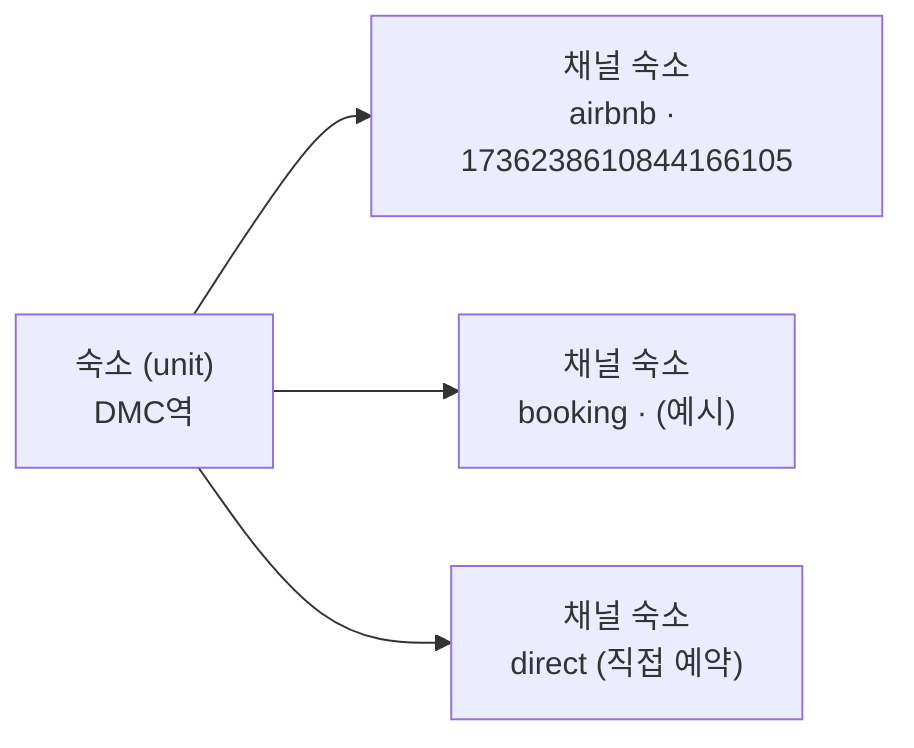

# 10. 멀티채널 확장

## 1. 범위와 원칙

- **MVP(M1~M5)는 에어비앤비 한 채널만 연동합니다.** 다른 채널 지원은 계획이 확정됐고(M6 이후), 대상 채널과 시점은 아직 정하지 않았습니다([09](09-roadmap.md) 오픈 이슈).
- 데이터 모델과 커넥터 인터페이스는 **처음부터 다채널 구조**로 만듭니다. 숙소와 리스팅을 1:1로 묶은 채 출시하면, 나중에 모든 테이블의 외래 키를 바꾸는 마이그레이션이 필요하기 때문입니다.
- **숙소 중심 원칙**: 운영 설정, 요금 규칙, 청소, 지식베이스는 실제 공간인 **숙소(unit)** 에 붙입니다. 채널은 숙소를 파는 창구일 뿐입니다.

## 2. 숙소와 채널 숙소



| 항목 | 숙소(unit) | 채널 숙소(channel listing) |
|------|:---------:|:-------------------------:|
| 별칭, 시간대, 체크인/아웃 시각 | ○ | |
| 가용 상태 (모든 채널 예약 + 차단의 합) | ○ | 채널이 보고한 값 |
| 요금 규칙, 요금 한계, 당일 인하, 공실 시장가 | ○ | 채널별 가격 조정(%) |
| 실제 판매 요금 | | ○ |
| 예약, 메시지 스레드 | ○ (소속) | ○ (출처) |
| 청소, 지출, 담당 직원, 지식베이스, CS 설정 | ○ | |
| 정산 | | ○ (채널별 정산 방식) |

- MVP에서는 에어비앤비 리스팅 1개마다 숙소를 1개씩 자동으로 만듭니다(1:1). 화면에는 숙소만 보이므로 사용자 경험은 지금 설계와 같습니다.
- M6부터는 새 채널을 연결할 때 리스팅을 **기존 숙소에 매핑**하는 단계를 둡니다(이름·주소 유사도로 자동 제안하고, 호스트가 확인).
- 리스팅 1개가 숙소 여러 개를 묶는 구조(독채 리스팅 + 방별 리스팅)는 범위 밖입니다.

## 3. 가용성 동기화 (이중 예약 방지)

다채널에서 가장 중요하고 가장 위험한 기능입니다. 한 채널에서 예약이 들어오면 다른 채널에서는 바로 판매를 막아야 합니다.

### 3.1 흐름

| 사건 | 처리 |
|------|------|
| 채널 X에서 예약 감지 | `unit_days` 갱신 → 같은 숙소의 다른 채널 숙소마다 해당 박을 **차단**(`availability_changes` 아웃박스 → `connector.setAvailability`) → `blocked_by_us = true` 기록 |
| 예약 취소 감지 | `blocked_by_us = true`인 날짜만 **해제**. 호스트가 막은 날은 건드리지 않음 |
| 호스트가 우리 캘린더에서 차단·해제 | 모든 채널에 반영 |
| 호스트가 채널 앱에서 직접 차단 | 숙소 차단으로 간주해 다른 채널에도 반영 (설정, 기본 켬) |

- **루프 방지**: `blocked_by_us = true`인 차단은 '호스트 차단'으로 해석하지 않습니다. 이렇게 하지 않으면 A→B로 보낸 차단이 다시 B→A로 돌아옵니다.
- 가용성 반영 잡은 다른 잡보다 **우선순위가 높은 큐**로 처리합니다.

### 3.2 지연과 위험

이중 예약이 생길 수 있는 시간은 `감지 지연 + 반영 지연`입니다.

- 다채널 숙소는 예약 동기화 주기를 5분으로 줄이고, 이메일 트리거(예약 확정 메일, [04 §7.3](04-airbnb-integration.md#73-새-메시지-감지)과 같은 방식)로 감지 지연을 줄입니다.
- 반영이 실패하면 재시도하고, **즉시 호스트에게 긴급 알림**을 보냅니다. 이 실패는 실제 이중 예약으로 이어질 수 있습니다.

### 3.3 이중 예약 감지

같은 숙소에서 확정 예약 두 건의 박이 겹치면 `booking_conflicts`에 기록하고 긴급 알림을 보냅니다. **자동 취소는 하지 않습니다.** 취소 패널티와 게스트 대응은 호스트가 채널 고객센터를 통해 결정합니다.

## 4. 채널별 요금

```
숙소 희망 요금 (05 §2, 한계·반올림 적용)
  → 채널 숙소마다: round(숙소 요금 × (1 + price_markup_pct / 100))
  → 채널 현재 요금과 비교 → 다르면 적용
```

- **가격 조정(%)** 은 채널마다 다른 수수료를 보전하기 위한 값입니다. 에어비앤비는 기본 0%입니다.
- 요금 쓰기를 지원하지 않거나 `push_prices = false`인 채널은 요금을 관리하지 않습니다.
- 공실 시장가의 시장 데이터는 **에어비앤비 채널 숙소에서만** 가져와 숙소 단위로 씁니다.
- 당일 인하는 tick마다 숙소의 모든 채널에서 오늘 가용 상태를 다시 읽고, 요금을 관리하는 모든 채널에 함께 적용합니다.
- 채널별 규칙 오버라이드(특정 채널만 다른 규칙)는 후속 후보입니다.

## 5. 메시지

- 인박스는 하나로 통합하고 스레드에 **채널 배지**를 붙입니다. 분류, 초안, 정책 엔진([06](06-cs-messaging.md))은 채널과 무관하게 동작합니다.
- 채널마다 메시지 읽기·발송 지원 여부가 다릅니다. 발송을 지원하지 않는 채널의 예약은 예약 메시지 대상에서 빠지고, 예약 상세에 '수동 안내 필요'로 표시합니다.
- 예약 메시지 템플릿에 **대상 채널**을 지정할 수 있습니다(기본: 전체).
- 연락처 공유 제한처럼 채널별로 다른 정책은 정책 엔진의 채널별 규칙 훅으로 처리합니다.

## 6. 정산

- 정산 방식이 채널마다 다릅니다.
  - 수수료를 뗀 금액을 지급하는 채널(에어비앤비)
  - 총액을 받은 뒤 수수료를 따로 청구하는 채널
  - 현장 결제
- `payout_lines.kind`에 `commission`, `payment_fee`(음수)를 추가해서 **매출 = 순 정산액 합계**라는 정의를 채널과 무관하게 유지합니다.
- 정산일 개념이 없는 채널(현장 결제)은 체크인일을 정산일로 씁니다.
- 대시보드에 채널별 매출 분해 차트를 추가합니다.

## 7. 연동 방식

다른 채널도 공식 API는 대부분 인증된 연동 파트너(채널 매니저)에게만 열려 있습니다. 채널마다 [04 §2](04-airbnb-integration.md#2-선택지)와 같은 선택지를 평가합니다.

| 단계 | 내용 | 얻는 것 | 한계 |
|------|------|---------|------|
| 1. iCal 허브 | 채널 숙소마다 iCal 내보내기 URL 제공 + 다른 채널 iCal 가져오기 | 약관 리스크 없이 빠르게 다채널 가용성 연결 | 게스트 정보·요금·메시지 없음. 채널 쪽 가져오기 주기(보통 수 시간)만큼 이중 예약 위험(고지 필요) |
| 2. 채널별 커넥터 | 채널마다 드라이버 구현(예약·가용·요금·메시지) | 완전한 기능, 짧은 지연 | 채널마다 개발·유지 비용과 약관 리스크 |
| 장기 | 채널 매니저 파트너 인증 검토 | 공식 API 접근 | 인증 요건, 기간 |

- **iCal 내보내기**는 채널 숙소 단위로 만듭니다. 각 피드에는 숙소의 모든 비가용 날짜를 넣되, **그 채널 자신의 예약은 뺍니다.** 채널이 자기 예약을 차단으로 다시 가져오는 일을 막기 위해서입니다.
- 호스트가 이미 채널끼리 iCal을 직접 연결해 두었다면, 온보딩에서 우리 허브로 바꾸도록 안내합니다(중복 연결 방지).
- **직접 예약(direct)** 은 커넥터가 없는 내부 채널입니다. 전화·지인 예약을 수동으로 입력하면 다른 채널이 차단되고, 청소와 정산 집계에도 포함됩니다.

## 8. 커넥터 capabilities

```ts
type ConnectorCapabilities = {
  reservations: 'read' | 'none';
  availability: 'read' | 'read_write' | 'none';
  prices: 'read' | 'read_write' | 'none';
  marketData: boolean;
  messaging: 'read' | 'read_write' | 'none';
  payouts: 'read' | 'none';
};
```

| 채널 | 예약 | 가용 | 요금 | 시장가 | 메시지 | 정산 |
|------|------|------|------|--------|--------|------|
| airbnb (드라이버 C) | read | read_write | read_write | ○ | read_write | read |
| ical | read (날짜만) | read | none | × | none | none |
| direct | 내부 입력 | 내부 | none | × | none | 내부 입력 |
| 기타 채널 | 채널 결정 후 조사 | | | | | |

기능은 capabilities를 보고 단계적으로 동작합니다. 예를 들어 요금 엔진은 `prices: 'read_write'`인 채널만 적용 대상에 넣고, 예약 메시지는 `messaging: 'read_write'`인 채널만 대상으로 합니다.

## 9. 단계 계획

| 단계 | 내용 |
|------|------|
| M1~M5 (MVP) | 다채널 데이터 모델(숙소/채널 숙소 분리)과 채널 중립 커넥터 인터페이스. 연동 채널은 에어비앤비 1개 |
| **M6 멀티채널 1단계** | 숙소-채널 매핑 UI, iCal 허브, 직접 예약 입력, 가용성 동기화(에어비앤비 차단 쓰기 포함), 이중 예약 감지, 채널 배지 |
| M7~ | 대상 채널별 커넥터, 채널별 가격 조정, 메시지 통합, 채널별 정산 |

## 10. 결정 필요

- 대상 채널과 우선순위 (예: Booking.com, Agoda, 국내 OTA). 채널마다 연동 방식 조사가 선행돼야 합니다.
- 다채널 숙소의 예약 동기화 주기. 짧을수록 이중 예약 위험은 줄지만, 비용과 탐지 위험이 늘어납니다.
- 채널 앱에서 직접 만든 차단을 다른 채널로 전파할지 (제안: 전파)
